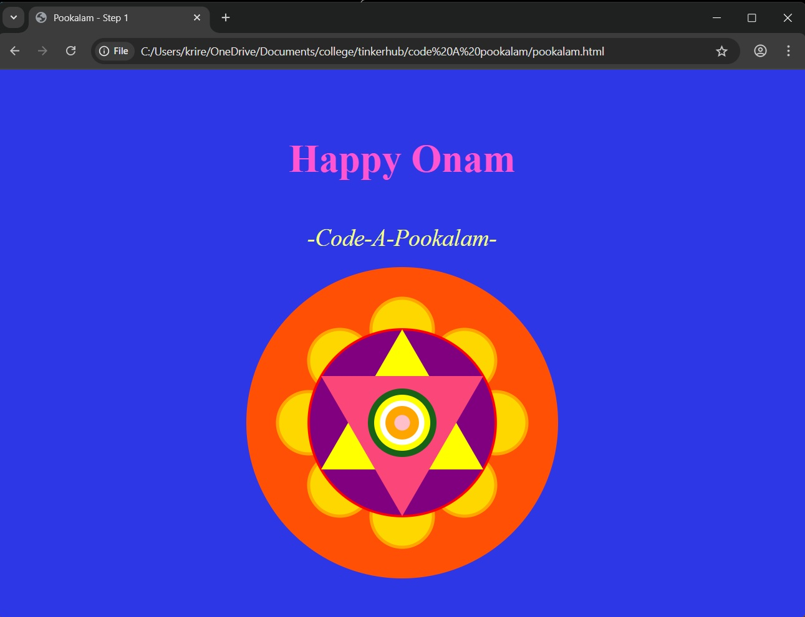
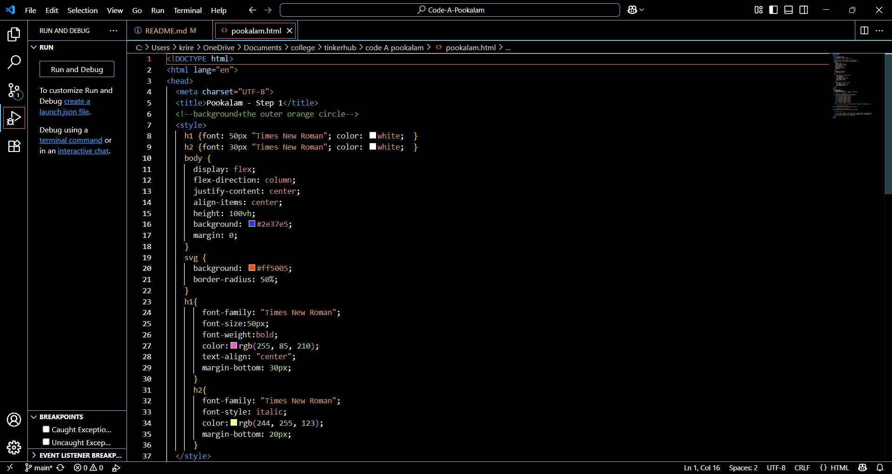

# Code-A-Pookalam 🌸
Welcome to CODE-A-പൂക്കളം, a creative coding challenge scheduled from September 1–6, where tradition meets technology! 🌼

Your Details
Krishna Rengith - Computer Science Engineering - S1

Hosted Pookalam Link
https://krengith.github.io/index.html

Pookalam Description

    With the thought of a comical pookalam in mind I tried my best to go for the 
simplest design out there. Although I needed the assistance of chat GPT at the beginning I had figured out the basic features in order to create a colorful minimalistic pookalam!
🌸🌻🌺🪷🌷

Technologies Used
-Chat gpt
-Visual Studio Code
-git

### Video explaining How you build the pookalam

### Screenshots
 

Happy Onam !  
Made with ❤️ at TinkerHub LBSITW
